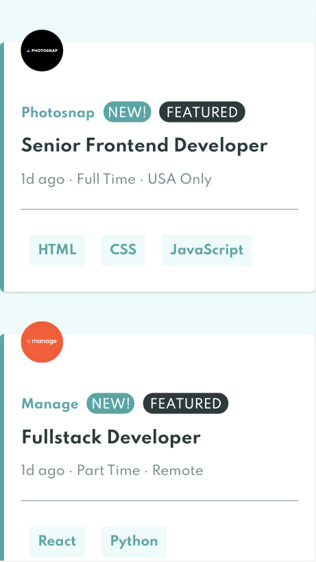

# Frontend Mentor - Job listings with filtering solution

This is a solution to the [Job listings with filtering challenge on Frontend Mentor](https://www.frontendmentor.io/challenges/job-listings-with-filtering-ivstIPCt). Frontend Mentor challenges help you improve your coding skills by building realistic projects. 

## Table of contents

- [Overview](#overview)
  - [The challenge](#the-challenge)
  - [Screenshot](#screenshot)
  - [Links](#links)
- [My process](#my-process)
  - [Built with](#built-with)
  - [Continued development](#continued-development)
  - [Useful resources](#useful-resources)

## Overview

### The challenge

Users should be able to:

- View the optimal layout for the site depending on their device's screen size
- See hover states for all interactive elements on the page
- Filter job listings based on the categories

### Screenshot

### Links

- Live Site URL: [Github Pages](https://jdegand.github.io/job-listings-with-filtering/)

## My process

### Built with

- Semantic HTML5 markup
- CSS custom properties
- Flexbox
- CSS Grid
- [React](https://reactjs.org/)
- [Create React App](https://github.com/facebook/create-react-app)

### Continued development

- Clean up CSS organization
- Filters but no way to really go backwards 
- Router?
- Pagination
- Fetch instead of just importing the data

### Useful resources

- [MDN Docs](https://developer.mozilla.org/en-US/docs/Web/API/Fetch_API) - Fetch
- [Stack Overflow](https://stackoverflow.com/questions/49481934/fetching-local-json) - Fetch local json
